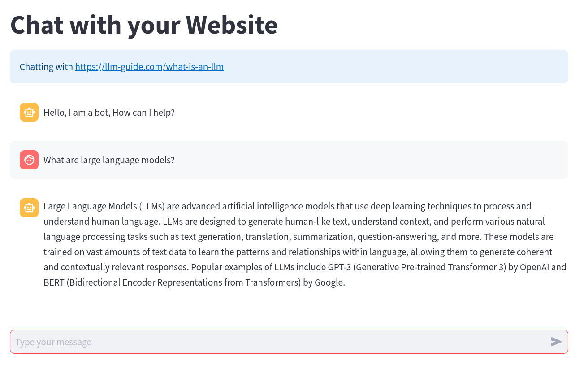

# Chat-with-Website

## Documentation: Chat with Your Website

1. Setup:

    Generate OpenAI API Key: To use this code, you need to obtain an API key from OpenAI. You can generate one by signing up on the OpenAI website and obtaining your API key from the dashboard.
    Store API Key: Once you have your API key, create a .env file in the project directory and store your API key in it as OPENAI_API_KEY="your_api_key_here".

2. Running the Code:

    This code is designed to be run using Streamlit. To run the application:

    "streamlit run app.py"

3. Functionality Overview:

    get_vectorstore_from_url(url):
        This function fetches text data from a given website URL, processes it into document form, and generates a vector store using OpenAI embeddings.
    get_context_retriever_from_url(vector_store):
        This function creates a context retriever chain using the provided vector store, configuring it for conversational context understanding.
    get_conversational_rag_chain(retriever_chain):
        This function constructs a conversational retrieval and generation (RAG) chain based on the given context retriever chain, facilitating the AI's conversational abilities.
    get_response(user_query, vector_store, chat_history):
        This function orchestrates the entire conversational process, generating a response to a user query by invoking the conversational RAG chain with appropriate inputs.

4. Streamlit Usage:

    Sidebar:
        Users interact with the application through a sidebar where they input the website URL.
    Main Interaction:
        After entering a valid URL, users can type messages into the chat interface to initiate conversation with the website.
    Response Display:
        The application displays both AI and human messages within the chat interface, providing a seamless conversational experience.

5. Streamlit:

    Streamlit is a Python library that allows developers to create interactive web applications with simple Python scripts.
    It provides various components such as text inputs, buttons, and charts, enabling developers to build powerful web interfaces directly from their Python code.
    Streamlit automatically updates the web interface in response to changes in the underlying data or user inputs, making it ideal for creating dynamic applications like chatbots.

